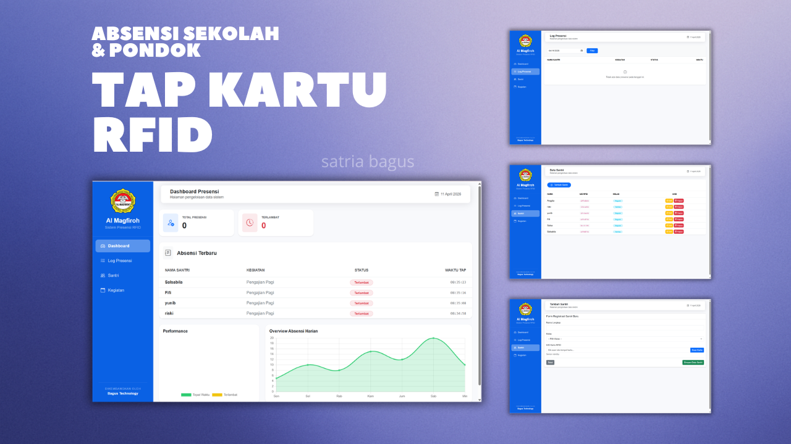

# Aplikasi Web Sistem Absensi Sekolah Berbasis `Tap Kartu`   (RFID)

---

Aplikasi Web Sistem Absensi Sekolah adalah sebuah proyek yang bertujuan untuk mengotomatisasi proses absensi di lingkungan sekolah. Aplikasi ini dikembangkan dengan menggunakan framework CodeIgniter 4 dan didesain untuk mempermudah pengelolaan dan pencatatan kehadiran siswa dan guru.

> [Instalasi & Cara Penggunaan](#cara-penggunaan)

## Fitur Utama

- **QR Code scanner.** Setiap siswa/guru menunjukkan qr code kepada perangkat yang dilengkapi dengan kamera. Aplikasi akan memvalidasi QR code dan mencatat kehadiran siswa ke dalam database.
- **RFID Integration.** Dukungan presensi menggunakan RFID card sebagai alternatif QR Code. Setiap siswa/guru dapat menggunakan RFID card untuk melakukan presensi dengan validasi kode RFID yang unik.
- **Notifikasi Presensi via WhatsApp**. Setelah berhasil scan dan presensi, pemberitahuan dikirim ke nomor hp siswa melalui whatsapp.
- **Login petugas.**
- **Dashboard petugas.** Petugas sekolah dapat dengan mudah memantau kehadiran siswa dalam periode waktu tertentu melalui tampilan yang disediakan.
- **Dashboard Wali Kelas.** Fitur khusus untuk guru wali kelas dengan kemampuan:
  - Memantau kehadiran siswa di kelas yang diampu
  - Mengelola data kehadiran siswa per kelas
  - Generate QR code untuk siswa di kelasnya
  - Generate laporan kehadiran khusus untuk kelas yang diampu
- **QR Code generator & downloader.** Petugas yang sudah login akan men-generate dan/atau mendownload qr code setiap siswa/guru. Setiap siswa akan diberikan QR code unik yang terkait dengan identitas siswa. QR code ini akan digunakan saat proses absensi.
- **Ubah data absen siswa/guru.** Petugas dapat mengubah data absensi setiap siswa/guru. Misalnya mengubah data kehadiran dari `tanpa keterangan` menjadi `sakit` atau `izin`.
- **Tambah, Ubah, Hapus(CRUD) data siswa/guru.**
- **Tambah, Ubah, Hapus(CRUD) data kelas.**
- **Lihat, Tambah, Ubah, Hapus(CRUD) data petugas.** (khusus petugas yang login sebagai **`superadmin`**).
- **Generate Laporan.** Generate laporan dalam bentuk pdf.
- **Import Data.** Import data secara massal menggunakan file CSV:
  - Import data siswa dalam jumlah banyak
  - Import data guru
  - Import data kelas
  - Import data jurusan
- **Backup & Restore.** Backup dan restore database serta file foto/QR code.

> [!NOTE]
>
> ## Framework dan Library Yang Digunakan
>
> - [CodeIgniter 4](https://github.com/codeigniter4/CodeIgniter4)
> - [Material Dashboard Bootstrap 4](https://www.creative-tim.com/product/material-dashboard-bs4)
> - [Myth Auth Library](https://github.com/lonnieezell/myth-auth)
> - [Endroid QR Code Generator](https://github.com/endroid/qr-code)
> - [ZXing JS QR Code Scanner](https://github.com/zxing-js/library)
> - [Chart.js](https://www.chartjs.org/)
>
> ---
>
> - [Fonnte](https://fonnte.com/) - WhatsApp API untuk mengirim pesan notifikasi
